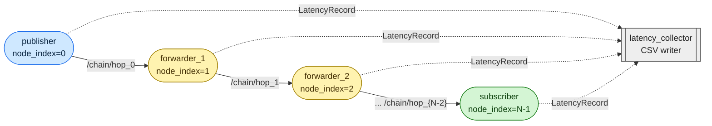

# ros_latency_tests

Latency tests for different ROS 2 middlewares and message types.

A publisher emits stamped messages at a fixed rate into a chain of zero or
more forwarders, terminating at a subscriber. Every node publishes a
`latency_tests_msgs/LatencyRecord` on `/latency/records` as it processes each
message; a collector correlates them and writes per-hop + end-to-end CSVs
(plus a summary) to `data/results/`.



`num_nodes=2` is pub → sub with no forwarders (single hop).
`num_nodes=5` is pub → fwd → fwd → fwd → sub (four hops).
All nodes run inside one multi-threaded composable container.

The plots below shows a single hop pub → sub latency for:

- std_msgs/Float64

- geometry_msgs/TransformStamped

- sensor_msgs/PointCloud2 at 1 MB

DDS choices of cyclonedds, fastdds, fastdds_dynamic, and zenoh are compared with and without intraprocess communications for each message type.
Transmission rates were 20 Hz and data was collected for 600 seconds in all cases.
Each plot is for a different Linux kernel.

**5.15.0-139-generic**


**5.15.119-rt65**


**6.8.0-107-generic**


## Quick start

```shell
git clone https://github.com/MShields1986/ros_latency_tests.git
cd ros_latency_tests

# Run one RMW end-to-end (no plot):
./run_single.sh cyclonedds

# Run every Tier 1 RMW and then plot the distributions:
./run_all.sh
# override the list:
./run_all.sh "cyclonedds zenoh"
```

Results land in `data/results/` as
`latency_<rmw>_<msg>_<N>nodes_<T>threads_<actual_payload>B_<rate>hz_<ipc|noipc>_<ts>.csv`,
each with a `#`-prefixed metadata header (pipeline config, intra-process flag,
host, CPU, OS, kernel). `run_all.sh` additionally emits a `violin_*.png` —
its title and subtitle are pulled from the CSV metadata, so the CPU model,
OS and kernel shown on the plot reflect the machine that *produced* the data,
not the one running the plotter.

## Knobs

Pass launch args after the service name via `docker compose run`, e.g.

```shell
docker compose -f docker/docker-compose.yaml run --rm cyclonedds \
  ros2 launch latency_tests latency_pipeline.launch.py \
    message_type:=sensor_msgs/PointCloud2 \
    payload_bytes:=1048576 \
    num_nodes:=5 \
    num_threads:=1 \
    publish_rate_hz:=100.0 \
    use_intra_process_comms:=true \
    duration_s:=30.0
```

| launch arg                | default                     | notes |
|---------------------------|-----------------------------|-------|
| `message_type`            | `sensor_msgs/PointCloud2`   | see the list below |
| `num_nodes`               | `2`                         | pub + forwarders + sub, `>=2` |
| `num_threads`             | `2`                         | executor threads in container (0 = hw concurrency) |
| `payload_bytes`           | `1048576`                   | target serialized size for variable-length fields |
| `publish_rate_hz`         | `10.0`                      | publisher tick rate |
| `use_intra_process_comms` | `false`                     | enable rclcpp IPC on every chain node; recorded in CSV and the plot label |
| `warmup_s`                | `10.0`                      | delay before the publisher starts |
| `duration_s`              | `600.0`                     | seconds before the launch shuts itself down |

Supported `message_type` values come from `src/latency_tests/launch/latency_pipeline.launch.py` (`_TYPE_TAGS`).
Adding a new one is one `.cpp` line in `src/latency_tests/src/components/` plus the tag in that map.

## Test matrix (`run_all.sh`)

`run_all.sh` runs the cartesian product of every axis.
Each axis is a space-separated list and can be overridden from the environment:

```shell
MATRIX_RMWS="cyclonedds zenoh" \
MATRIX_MESSAGES="sensor_msgs/PointCloud2 sensor_msgs/Image" \
MATRIX_PAYLOADS="1024 1048576" \
MATRIX_NODES="2 5" \
MATRIX_THREADS="1 4" \
MATRIX_IPCS="false true" \
MATRIX_RATE=50.0 \
MATRIX_DURATION=30.0 \
./run_all.sh
```

Legacy form `./run_all.sh "cyclonedds zenoh"` still works — the positional argument replaces `MATRIX_RMWS`.
When every axis is a single value, the matrix collapses to a single run.

## Supported middlewares

| service | RMW | status |
|---|---|---|
| `cyclonedds` | `rmw_cyclonedds_cpp` | ✅ |
| `fastdds` | `rmw_fastrtps_cpp` | ✅ |
| `fastdds_dynamic` | `rmw_fastrtps_dynamic_cpp` | ✅ |
| `zenoh` | `rmw_zenoh_cpp` | ✅ (router started in container) |
| `iceoryx` | `rmw_iceoryx_cpp` (v1) | ⚠ exploratory |
| `iceoryx2` | — | 🚧 placeholder, not implemented |
| `agnocast` | — | 🚧 placeholder, not implemented |

## Supported messages

| package | type | payload field? |
|---|---|---|
| `sensor_msgs` | `PointCloud2` | ✅ |
| `sensor_msgs` | `Image` | ✅ |
| `sensor_msgs` | `Imu` | — |
| `sensor_msgs` | `LaserScan` | ✅ |
| `sensor_msgs` | `JointState` | ✅ |
| `sensor_msgs` | `PointCloud` | ✅ |
| `sensor_msgs` | `Range` | — |
| `sensor_msgs` | `Temperature` | — |
| `sensor_msgs` | `FluidPressure` | — |
| `nav_msgs` | `Odometry` | — |
| `nav_msgs` | `Path` | ✅ |
| `geometry_msgs` | `PointStamped` | — |
| `geometry_msgs` | `PoseStamped` | — |
| `geometry_msgs` | `TwistStamped` | — |
| `geometry_msgs` | `WrenchStamped` | — |
| `geometry_msgs` | `TransformStamped` | — |
| `std_msgs` | `Header` | — |
| `std_msgs` | `String` | ✅ |
| `std_msgs` | `Bool` | — |
| `std_msgs` | `Byte` | — |
| `std_msgs` | `Char` | — |
| `std_msgs` | `ColorRGBA` | — |
| `std_msgs` | `Empty` | — |
| `std_msgs` | `Float32` | — |
| `std_msgs` | `Float64` | — |
| `std_msgs` | `Int8`, `Int16`, `Int32`, `Int64` | — |
| `std_msgs` | `UInt8`, `UInt16`, `UInt32`, `UInt64` | — |
| `std_msgs` | `MultiArrayDimension` | — |
| `std_msgs` | `MultiArrayLayout` | — |
| `std_msgs` | `ByteMultiArray` | ✅ |
| `std_msgs` | `Float32MultiArray`, `Float64MultiArray` | ✅ |
| `std_msgs` | `Int8MultiArray`, `Int16MultiArray`, `Int32MultiArray`, `Int64MultiArray` | ✅ |
| `std_msgs` | `UInt8MultiArray`, `UInt16MultiArray`, `UInt32MultiArray`, `UInt64MultiArray` | ✅ |

Types marked with ✅ have a variable-length field that is sized to`payload_bytes`; unmarked types are fixed-size and ignore that knob.

Note: `std_msgs` primitives have no `std_msgs/Header`, so they can't carry the `pipeline_id:<seq>` correlation id through a chain. Forwarders fall back to a local counter, which is fine for `num_nodes=2` (pub → sub) but can give misleading hop numbers in longer chains if any drops occur. For multi-hop runs prefer a type with a header.
